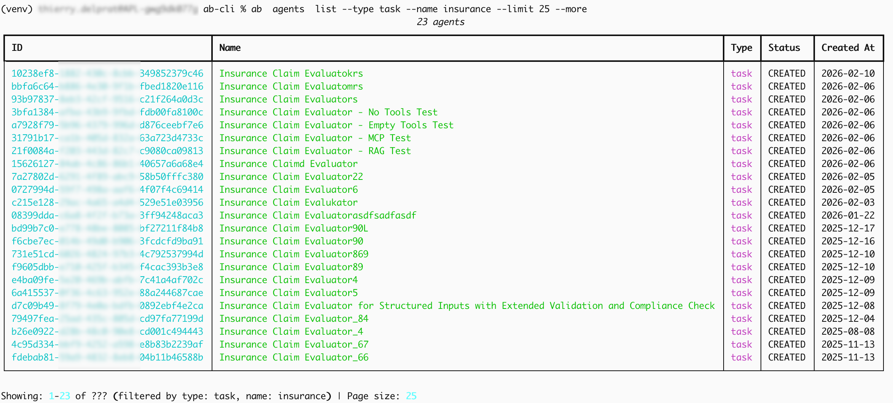

# Agent Builder CLI (ab-cli)

[](https://github.com/tiry/abcli/actions/workflows/ci.yml)
[](https://github.com/tiry/abcli/actions/workflows/ci.yml)
[](https://github.com/tiry/abcli/actions/workflows/ci.yml)
[](https://www.python.org/downloads/)
[](https://opensource.org/licenses/MIT)

Command-line interface for the [Hyland Content Intelligence Agent Builder Platform](https://hyland.github.io/ContentIntelligence-Docs/AgentBuilderPlatform).

## Overview

The Agent Builder CLI provides a convenient way to create, manage, and invoke AI agents using the Hyland Content Intelligence Agent Builder Platform API. It enables users to interact with the platform through a simple command-line interface, making it easy to integrate AI agents into automation workflows and development pipelines.

Key features include:

- **Agent Management**: Create, list, update, and delete AI agents
- **Version Management**: Create new agent versions and track changes
- **Agent Invocation**: Execute agents with chat messages or structured inputs
- **Resource Discovery**: List available LLM models and guardrails
- **Testing Tools**: Validate configuration and API connectivity

## Why Use ab-cli?

The Agent Builder CLI is designed to streamline AI agent development and operations. Here are the key use cases:

### Introspect Agents

Quickly discover what agents are deployed and examine their configurations:

```bash
# List all deployed agents
ab agents list

# Get detailed information about a specific agent
ab agents get <agent-id>

# View agent versions
ab versions list <agent-id>
```

### Tweak and Test Agents

Rapidly iterate on agent configurations and validate changes:

```bash
# Update agent metadata
ab agents patch <agent-id> --name "New Name" --description "Updated description"

# Test agent behavior with chat
ab invoke chat <agent-id> --message "Test this change"

# Test with streaming
ab invoke chat <agent-id> --message "Analyze this" --stream

# Create new agent version
ab versions create <agent-id> --config updated-config.json
```

### Validate Access and Environment Configuration

Ensure your authentication and API access are correctly configured:

```bash
# Validate configuration and test API connectivity
ab validate --show-config

# Get authentication token and ready-to-use API commands
ab auth
ab auth --curl
ab auth --wget --post
```

### Multi-Environment Management

Use profiles to seamlessly work across development, staging, and production environments:

```bash
# Work with development environment
ab --profile dev agents list

# Switch to production
ab --profile prod agents list

# Compare configurations across environments
ab --profile dev agents get <agent-id>
ab --profile prod agents get <agent-id>

# list available models in the dev environent
ab --profile dev resources models

```

See [configuration-profiles](doc/CONFIG.md#configuration-profiles) for more details.

### Record and Analyze Datasets

Collect request/response pairs for testing, debugging, and model evaluation:

```bash
# Collect chat responses from CSV file
ab invoke collect <agent-id> --chats messages.csv

# Collect with custom output location
ab invoke collect <agent-id> --chats messages.csv --out results.jsonl

# Collect task agent responses
ab invoke collect <agent-id> --tasks tasks.jsonl
```

See [batch-collection is USAGE.md](doc/USAGE.md#batch-collection) for more details.

## Quick Start

### Installation

```bash
# Clone the repository
git clone <repository-url>
cd ab-cli

# Create and activate virtual environment
python -m venv venv
source venv/bin/activate  # On Windows: venv\Scripts\activate

# Install in development mode
pip install -e ".[dev]"
```

See [INSTALL.md](doc/INSTALL.md) for detailed installation instructions.

### Configuration

```bash
# Interactive configuration wizard
ab configure

# Or manually copy and edit the example configuration
cp config.example.yaml config.yaml

# Validate your configuration
ab validate --show-config
```

For detailed information about all configuration options, see [CONFIG.md](doc/CONFIG.md).

### Basic Usage

```bash
# List your agents
ab agents list
```

**Example Output:**

</img>

See [USAGE.md](doc/USAGE.md) for comprehensive command documentation.

## Project Structure

```
ab-cli/
├── ab_cli/                 # Core package directory
│   ├── __init__.py
│   ├── api/                # API client components
│   ├── cli/                # CLI commands and interfaces
│   ├── config/             # Configuration handling
│   ├── models/             # Data models
│   └── utils/              # Utility functions
├── doc/                    # Documentation files
│   ├── README.md           # Documentation index
│   ├── CONFIG.md           # Configuration guide
│   ├── INSTALL.md          # Installation instructions
│   ├── TESTING.md          # Testing guide
│   ├── UI.md               # UI documentation
│   ├── USAGE.md            # Command reference
│   └── pics/               # Documentation images
├── tests/                  # Test suite
├── specs/                  # Specification documents
├── config.example.yaml     # Example configuration
├── pyproject.toml          # Project dependencies
└── README.md               # Project overview
```

## Documentation

For complete documentation, see the [doc/](doc/) directory:

- [USAGE.md](doc/USAGE.md): Detailed command documentation with examples
- [CONFIG.md](doc/CONFIG.md): Configuration parameters and options
- [INSTALL.md](doc/INSTALL.md): Installation and setup instructions
- [UI.md](doc/UI.md): Web-based user interface guide
- [TESTING.md](doc/TESTING.md): Instructions for testing the CLI

## Features

- [x] **Configuration Management**: Interactive setup wizard (`ab configure`), file-based config, profiles, environment variables
- [x] **Agent Management**: Create, list, get, update, patch, and delete AI agents
- [x] **Version Management**: Create, list, and manage agent versions
- [x] **Agent Invocation**: Chat mode, task mode, interactive REPL, streaming responses
- [x] **Batch Processing**: Collect request/response datasets from CSV/JSONL files
- [x] **Resource Discovery**: List available LLM models, guardrails, and system resources
- [x] **Authentication**: OAuth2 with token caching, generate curl/wget commands
- [x] **Profile Support**: Multi-environment management (dev, staging, prod)
- [x] **Output Formats**: Table, JSON, and YAML output formats with verbose mode
- [x] **Pagination**: Handle large result sets with configurable page sizes
- [x] **Web UI**: Streamlit-based interface for visual agent management
- [x] **Validation Tools**: Configuration testing and API connectivity checks

## Testing and CI

The project has a comprehensive test suite with separate coverage metrics for CLI and UI components:

- **CLI components**: Core functionality including API client, models, and CLI commands
- **UI components**: Streamlit-based web interface for agent management and interaction

### Running Tests

```bash
# Install development dependencies
pip install -e ".[dev]"

# Run all tests
pytest

# Run CLI tests only
pytest tests/test_api/ tests/test_cli/ tests/test_config/ tests/test_models/

# Run UI tests only
pytest tests/test_abui/

# Run tests with coverage report
pytest --cov=ab_cli --cov-report=term-missing
```

### Continuous Integration

The project uses GitHub Actions for continuous integration with the following parallel jobs:

- **Linting**: Code quality checks using ruff for linting, formatting, and mypy for type checking
- **CLI Tests**: Tests for core CLI functionality with dedicated coverage reporting
- **UI Tests**: Tests for UI components with separate coverage reporting
- **Build**: Package building for distribution (triggered only if all other jobs pass)
- **Badge Updates**: Automated updates to coverage badges (triggered only on master branch)

See [TESTING.md](doc/TESTING.md) for more information on testing practices and procedures.

## License

MIT